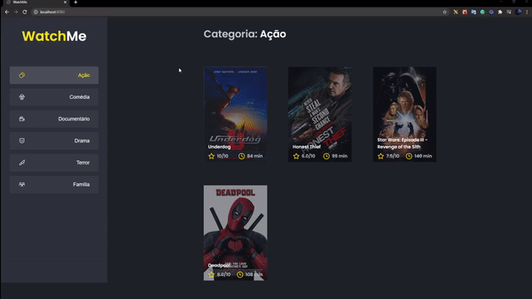

## WhatchMe
---
<h1 align="center">
  
</h1>

## About. 🚀
This project was made for a challenge for Bootcamp Ignite,
that was to improve how to separate the components on React 
using props.

---

## How to install run 💻

```bash
# 1. made git clone on your path 
$ git clone https://github.com/Luan4560/ignite-challenge-02.git

# 2. Go to respository on your path and run (Install the dependencies)

$ yarn or npm install 

# 3. Run yarn server to start server with fake api. It's run on url: http://localhost:3333

$ yarn server

# 4. Run yarn dev to run the app, and will run on url http://localhost:8080

$ yarn dev

```
---

## Techs used. 🎈

- React
- Typescript
- SCSS
- Axios

---

This project was resolved by Luan Nascimento 🤘